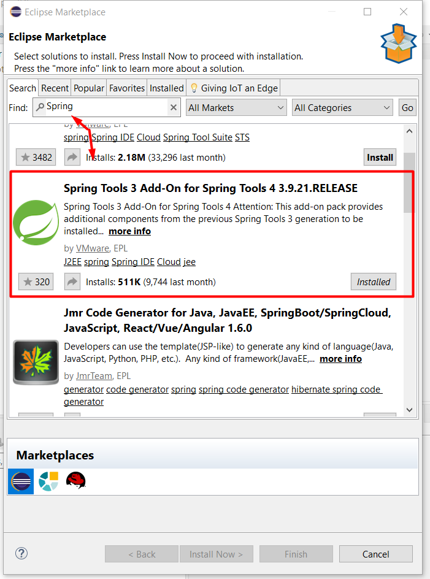
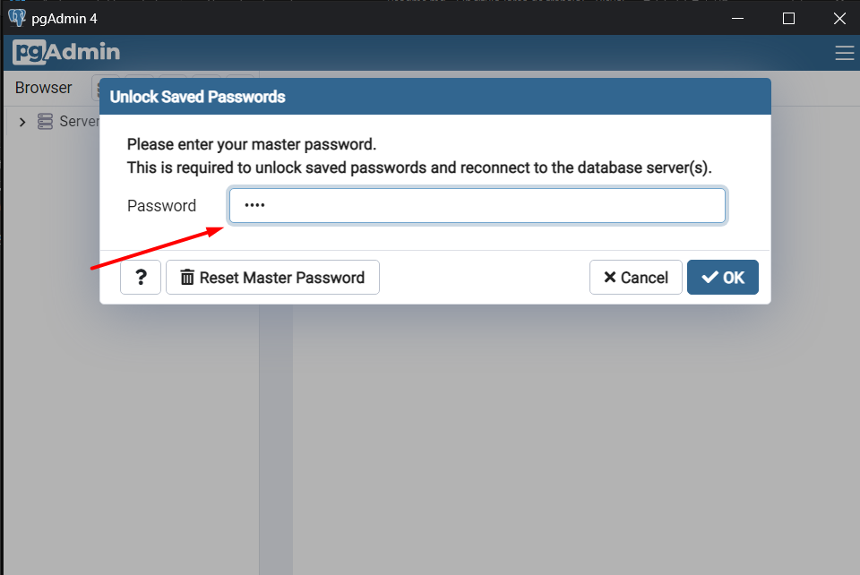

<h1 align="center">Guia para despliegue Backend</h1>
<!-- ------------------------------------------  -->
<h2 align="center"> 1. Descarga de programas necesarios </h2>

El proceso se realiza en un sistema operativo `Windows 10` acompañado de cada app necesario para le buen funcionamiento: 

<ul>
    <li><a href="https://www.eclipse.org/downloads/packages/release/2021-09/r">Eclipse</a> (IDE for java developers 2021-09)</li>
    <li><a href="https://www.postgresql.org/download/">PostgreSQL</a> (Version 14)</li>
    <li><a href="https://www.java.com/es/download/ie_manual.jsp">Java</a> (Version 8 Update 321)</li>
</ul>
<!-- ------------------------------------------  -->
<h2 align="center"> 2. Instalacion de programas necesarios</h2>

Cada proceso de instalacion es habitual, aceptar terminos y condiciones, siguiente... siguiente... instalar

<strong>Nota: </strong>En la instalacion de postgreSQL recuerda colocar los datos de seguridad de Name y Password
<!-- ------------------------------------------  -->
<h2 align="center"> 3. Configurar Eclipse con Springboot</h2>
 
Una vez abierto eclipse, nos dirigimos a la pestaña superior llamada Help -> Eclipse Marketplace

Luego buscamos Sprinboot en el Find e instalamos "Spring tools 3 Add-On for Spring Tools 4 3.9.21.RELEASE"

<!-- ------------------------------------------  -->
<h2 align="center"> 4. Configurar BD (PostgreSQL)</h2>

Con el programa descargado previamente (PostgreeSQL):

<ol>
    <!-- 1 -->
    <li>
Buscar la carpeta Postgree en el inicio (tecla windows) y abrir pgAdmin 4: 

    
    </li> 
    <!-- 2 -->
    <li>
Al ingresar se pedira la contraseña ingresada en la etapa de instalacion: 

    
    </li> 
    <!-- 3 -->
    <li>
Luego abre servers, posterior register y finalmente server: 

    
    </li> 
    <!-- 4 -->
    <li>
Se coloca nombre a la BD: BD_SafeLife(nombre opcional): 

    
    </li> 
    <!-- 5 -->
    <li>
Vamos a configurar nuestra BD: 

    Nos dirigimos hacia el menu Connection e ingresamos los datos: 
    <strong>Host: </strong>ec2-18-214-134-226.compute-1.amazonaws.com 
    <strong>Database: </strong>d4g3aaahil971t 
    <strong>User: </strong>prizigyckacpqw 
    <strong>Password: </strong>e2d23030a963fde759b5f8453ef983aeef8643ccfe444de26948dad7b98d3a35    
    
    </li> 
    <!-- 6 -->
    <li>
Luego nos dirigimos en la pestaña Advanced y en DB restriction agregamos el Database, finalizamos en Save: 

    
    </li> 
    <!-- 6 -->
    <li>
Verificamos que se hayan creado las tablas: 

    
    </li> 
<!-- ------------------------------------------  -->
<h2 align="center"> 5. Preparando el despliegue</h2>

Para un correcto despliegue de Backend, este, se debe descargar desde el repositorio de Github :

`https://github.com/GeanDev2022/Software/tree/Backend`

De esta forma: 

Luego descomprime este .ZIP en una carpeta de su interes, le queda una carpeta llamada "Software-Backend", dentro de ella se encuentra el codigo del Backend (ProyectoColab)

Luego, vamos a importar la carpeta ProyectoColab a eclipse

Para finalizar le damos click derecho encima de la carpeta principal del proyecto, luego en Run as y ejecutamos con Spring Boot App

Y vemos como se ejecuto correctamente

